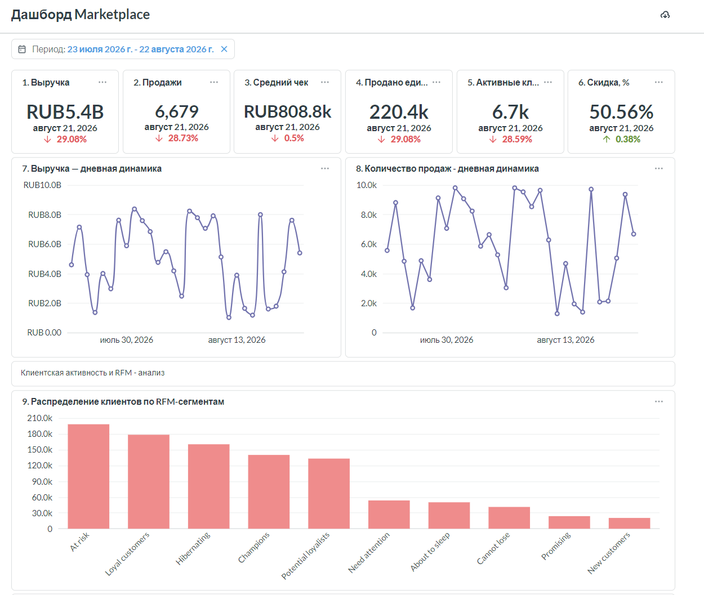
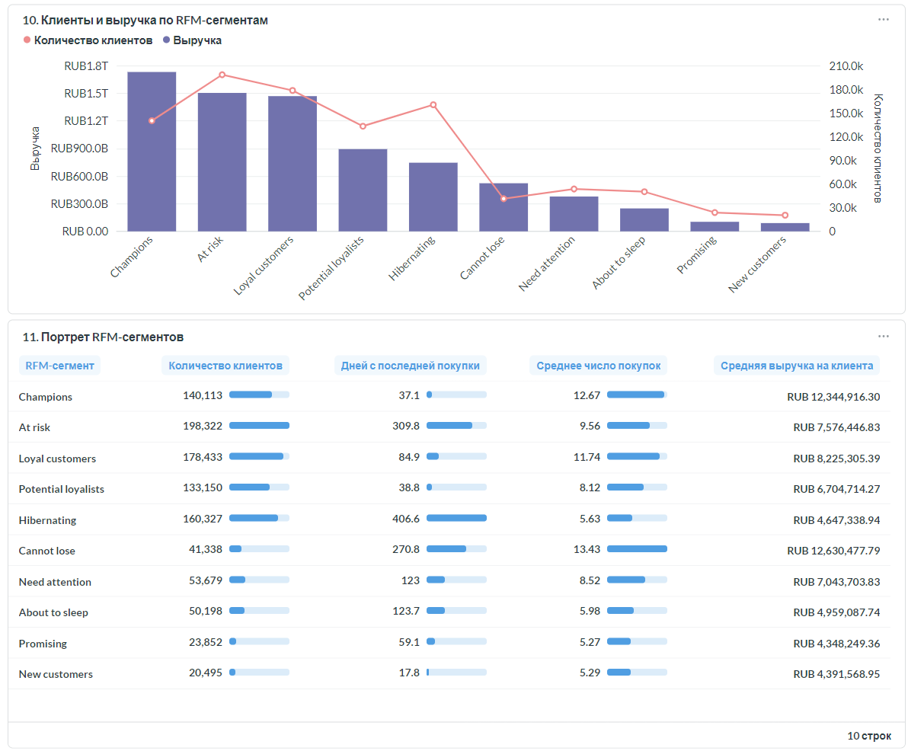
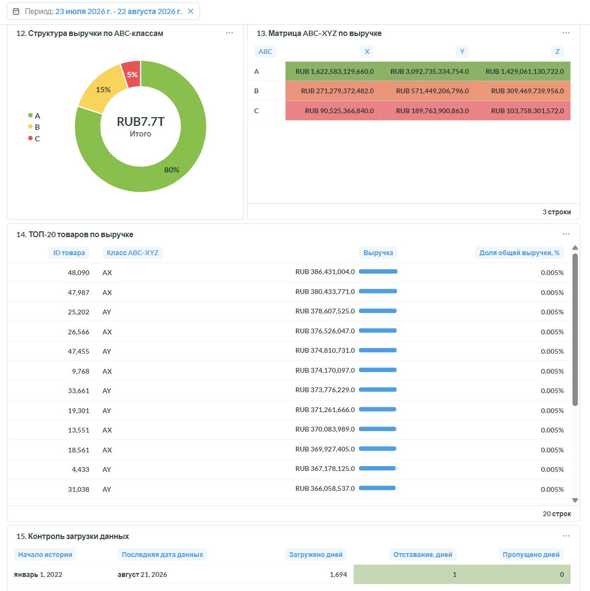

# Marketplace ETL Pipeline

Проект автоматизированного ETL-конвейера для получения данных о продажах интернет-магазина из API, проверки и преобразования данных и последующей загрузки в PostgreSQL.

## Цель проекта

Создать production-like ETL-процесс, который:

* получает данные о продажах из API;
* выполняет проверку и подготовку данных;
* сохраняет данные в PostgreSQL;
* поддерживает разовую историческую загрузку;
* выполняет ежедневную инкрементальную загрузку;
* предотвращает повторную загрузку одной даты;
* подготавливает аналитический слой для визуализации данных в Metabase.

## Архитектура

```text
API
 ↓
Проверка ответа
 ↓
Подготовка и валидация данных
 ↓
Проверка наличия даты в PostgreSQL
 ↓
Загрузка в raw.sales
```

В проекте предусмотрено два сценария запуска:

1. `load_history.py` — разовая загрузка исторических данных.
2. `main.py` — ежедневная загрузка данных за предыдущий день.

Оба сценария используют общий ETL-конвейер, реализованный в `pipeline.py`.

## Стек технологий

* Python 3.10
* pandas
* requests
* SQLAlchemy
* psycopg2
* PostgreSQL
* python-dotenv
* Jupyter Notebook
* Git
* Metabase
* Docker

## Что реализовано

- историческая загрузка данных начиная с 1 января 2022 года;
- ежедневная автоматическая загрузка данных за предыдущий день;
- защита от повторной загрузки уже существующих данных;
- повторные запросы к API при временных ошибках и тайм-аутах;
- хранение исходных данных в PostgreSQL и автоматическое обновление аналитических витрин;
- запуск ETL-процесса по расписанию с помощью cron;
- логирование этапов загрузки, ошибок и обновления витрин с ротацией файлов;
- интерактивный дашборд в Metabase;
- исследования ассортиментной матрицы и клиентской базы по данным за 2023 год.

[Открыть публичный дашборд Marketplace](https://154.59.111.57/public/dashboard/1c6ef843-e59b-47bd-93f9-6919ad7d42fe)

## Структура проекта

```text
marketplace_final_project/
├── config/
├── logs/
├── notebooks/
│   ├── 01_assortment_analysis_2023.ipynb
│   ├── 02_customer_analysis2023.ipynb
├── reports/
│   ├── 01_assortment_analysis_2023.pdf
│   ├── 02_customer_analysis2023.pdf
│   ├── dashboard_marketplace_01.png
│   ├── dashboard_marketplace_02.png
│   ├── dashboard_marketplace_03.png
├── sql/
│   ├── DDL.sql
│   ├── analytics.sql
│   ├── analytics_abc_xyz.sql
│   ├── analytics_product_monthly.sql
│   ├── analytics_rfm.sql
├── src/
│   ├── api_client.py
│   ├── data_preparation.py
│   ├── database.py
│   ├── load_history.py
│   ├── logger.py
│   ├── main.py
│   └── pipeline.py
├── tests/
├── .env.example
├── .gitignore
├── README.md
├── requirements-analysis.txt
└── requirements-etl.txt
```

Назначение основных файлов:

| Файл                  | Назначение                                    |
| --------------------- | --------------------------------------------- |
| `api_client.py`       | Получение данных из API за указанную дату     |
| `data_preparation.py` | Преобразование и проверка полученных данных   |
| `database.py`         | Подключение к PostgreSQL и загрузка DataFrame |
| `pipeline.py`         | Общий ETL-процесс обработки одной даты        |
| `load_history.py`     | Историческая загрузка данных                  |
| `main.py`             | Ежедневная загрузка данных за предыдущий день |
| `logger.py`           | Настройка журналирования                      |
| `DDL.sql`             | Создание схемы и таблицы PostgreSQL           |

## Структура данных

API возвращает сведения об операциях продажи:

| Поле API                                 | Поле в PostgreSQL       | Описание                                 |
| ---------------------------------------- | ----------------------- | ---------------------------------------- |
| `client_id`                              | `client_id`             | Идентификатор клиента                    |
| `gender`                                 | `gender`                | Пол клиента                              |
| `purchase_datetime`                      | `purchase_date`         | Дата покупки                             |
| `purchase_time_as_seconds_from_midnight` | `purchase_time_seconds` | Время покупки в секундах от начала суток |
| `product_id`                             | `product_id`            | Идентификатор товара                     |
| `quantity`                               | `quantity`              | Количество товара                        |
| `price_per_item`                         | `price_per_item`        | Цена единицы товара                      |
| `discount_per_item`                      | `discount_per_item`     | Скидка на единицу товара                 |
| `total_price`                            | `total_price`           | Итоговая сумма операции                  |

Итоговая сумма проверяется по формуле:

```text
total_price = quantity × (price_per_item − discount_per_item)
```

Отрицательные значения количества не удаляются, поскольку могут отражать возвраты.

## Проверки качества данных

Перед загрузкой выполняются следующие проверки:

* ответ API имеет ожидаемый формат;
* полученный DataFrame не пустой;
* присутствуют все обязательные столбцы;
* данные относятся к запрошенной дате;
* числовые поля корректно преобразуются;
* время находится в диапазоне от `0` до `86399`;
* `total_price` соответствует формуле расчёта;
* порядок столбцов соответствует структуре таблицы;
* дата ещё не загружена в PostgreSQL.

Если данные за дату уже существуют в `raw.sales`, повторная загрузка пропускается.

## Установка проекта

### 1. Клонирование репозитория

```bash
git clone <repository-url>
cd marketplace_final_project
```

### 2. Создание виртуального окружения

```bash
python -m venv .venv
```

Активация в Windows:

```bash
.venv\Scripts\activate
```

Активация в Linux:

```bash
source .venv/bin/activate
```

### 3. Установка ETL-зависимостей

```bash
python -m pip install --upgrade pip
pip install -r requirements-etl.txt
```

Для работы с ноутбуками и аналитикой:

```bash
pip install -r requirements-analysis.txt
```

## Настройка переменных окружения

Создайте файл `.env` в корневой папке проекта на основе `.env.example`:

```env
host=localhost
port=5432
dbname=retail_etl
user=postgres
password=your_password

API_URL=http://final-project-simulative.ru/data
```

Файл `.env` содержит параметры подключения и не должен добавляться в Git.

## Подготовка PostgreSQL

Создайте базу данных:

```sql
CREATE DATABASE retail_etl;
```

Подключитесь к созданной базе и выполните файл:

```text
sql/DDL.sql
```

Он создаёт необходимые объекты, включая схему `raw` и таблицу `raw.sales`.

Для ускорения проверки уже загруженных дат используется индекс:

```sql
CREATE INDEX IF NOT EXISTS idx_sales_purchase_date
ON raw.sales (purchase_date);
```

## Историческая загрузка

Историческая загрузка выполняется командой:

```bash
python src/load_history.py
```

Начальная дата загрузки:

```text
2022-01-01
```

Конечная дата определяется как предыдущий календарный день.

Скрипт:

* последовательно обрабатывает каждую дату;
* пропускает уже загруженные даты;
* продолжает работу после ошибки отдельного дня;
* записывает результаты в журнал;
* выводит итоговое количество загруженных, пропущенных и ошибочных дней.

## Ежедневная загрузка

Для загрузки данных за предыдущий день используется:

```bash
python src/main.py
```

Целевая дата рассчитывается автоматически:

```python
date.today() - timedelta(days=1)
```

Если дата уже присутствует в базе, загрузка безопасно пропускается.

## Проверка результата

Общая проверка загруженных данных:

```sql
SELECT
    MIN(purchase_date) AS min_date,
    MAX(purchase_date) AS max_date,
    COUNT(DISTINCT purchase_date) AS loaded_days,
    COUNT(*) AS total_rows
FROM raw.sales;
```

Проверка количества строк по дням:

```sql
SELECT
    purchase_date,
    COUNT(*) AS row_count
FROM raw.sales
GROUP BY purchase_date
ORDER BY purchase_date;
```

Проверка отсутствующих дат:

```sql
SELECT expected_date
FROM generate_series(
    (SELECT MIN(purchase_date) FROM raw.sales),
    (SELECT MAX(purchase_date) FROM raw.sales),
    INTERVAL '1 day'
) AS expected_date
LEFT JOIN (
    SELECT DISTINCT purchase_date
    FROM raw.sales
) AS loaded
    ON loaded.purchase_date = expected_date::date
WHERE loaded.purchase_date IS NULL
ORDER BY expected_date;
```

## Результаты первичной исторической загрузки

На момент завершения первоначальной загрузки:

| Показатель                   |    Результат |
| ---------------------------- | -----------: |
| Начальная дата               | `2022-01-01` |
| Последняя загруженная дата   | `2026-08-12` |
| Количество календарных дней  |      `1 685` |
| Количество строк             |  `9 254 763` |
| Пропущенные даты             |          `0` |
| Ошибки исторической загрузки |          `0` |

Ежедневная загрузка также успешно проверена: данные за `2026-08-12` были автоматически получены из API и загружены в PostgreSQL.

## Транзакции и обработка ошибок

Загрузка каждого DataFrame выполняется внутри транзакции SQLAlchemy.

При успешной загрузке выполняется `COMMIT`. При возникновении исключения выполняется автоматический `ROLLBACK`, поэтому дата либо загружается полностью, либо не загружается вовсе.

Ошибки не скрываются: они записываются в журнал и передаются вызывающему коду.

## Развёртывание проекта

Проект развёрнут на VPS под управлением Ubuntu 22.04 LTS.

Основные компоненты:

* PostgreSQL 18 — хранение исходных данных и аналитических витрин;
* Python 3.10 — выполнение ETL-процесса;
* cron — ежедневный автоматический запуск загрузки;
* Metabase — визуализация данных и аналитический дашборд;
* Nginx — обратный прокси для Metabase;
* Docker — запуск Metabase.

## ETL-процесс

Исторические данные загружены начиная с `2022-01-01`.

Ежедневная обработка запускается автоматически через cron и выполняет следующие действия:

1. Определяет дату загрузки как текущую дату минус один день.
2. Получает данные из API.
3. Проверяет, были ли данные за эту дату загружены ранее.
4. Выполняет подготовку и загрузку данных в `raw.sales`.
5. Обновляет аналитические материализованные представления.
6. Записывает результат выполнения в лог.

### Логирование

Все этапы ETL-процесса сопровождаются логированием:

- запуск ежедневной загрузки;
- запрос данных из API и номер попытки;
- HTTP-статус и количество полученных строк;
- подключение к PostgreSQL и загрузка данных;
- пропуск уже загруженной даты для обеспечения идемпотентности;
- обновление аналитических витрин;
- ошибки API, базы данных и преобразования данных.

Логи сохраняются в каталоге `logs/` по дням. Для ограничения занимаемого места настроена ротация логов. Файлы журналов исключены из Git, а пустой каталог сохраняется с помощью `.gitkeep`.

Пример успешного выполнения ежедневного ETL-процесса:

```text
2026-08-19 07:00:02 - INFO - Запуск ежедневной загрузки за 2026-08-18
2026-08-19 07:00:02 - INFO - Запрос данных за 2026-08-18. Попытка 1/2
2026-08-19 07:00:28 - INFO - Дата: 2026-08-18, HTTP статус: 200
2026-08-19 07:00:28 - INFO - За 2026-08-18 получено строк: 2140
2026-08-19 07:00:28 - INFO - Загружено в raw.sales 2140 строк
2026-08-19 07:00:42 - INFO - Витрина analytics.mv_daily_sales успешно обновлена
2026-08-19 07:02:06 - INFO - Витрина analytics.mv_customer_rfm успешно обновлена
2026-08-19 07:03:02 - INFO - Витрина analytics.mv_product_monthly_sales успешно обновлена
2026-08-19 07:03:11 - INFO - Витрина analytics.mv_product_abc_xyz успешно обновлена
2026-08-19 07:03:11 - INFO - Ежедневная обработка за 2026-08-18 завершена. Загружено строк: 2140
```
Для временных ошибок API предусмотрены повторные попытки запроса.

Ручной запуск ежедневной обработки:

```bash
python src/main.py
```

Запуск исторической загрузки:

```bash
python src/load_history.py
```

## Аналитический слой

В схеме `analytics` созданы материализованные представления:

* `mv_daily_sales` — ежедневные показатели продаж;
* `mv_customer_rfm` — показатели и RFM-сегменты клиентов;
* `mv_product_monthly_sales` — продажи товаров по месяцам;
* `mv_product_abc_xyz` — ABC–XYZ-классификация ассортимента.

Витрины автоматически обновляются после выполнения ежедневной загрузки.

SQL-скрипты создания витрин находятся в каталоге [`sql`](sql/).

## Дашборд Metabase

В Metabase реализован операционный дашборд, содержащий:

* основные KPI продаж;
* динамику выручки и количества продаж;
* показатели клиентской активности;
* RFM-анализ клиентской базы;
* ABC–XYZ-анализ ассортимента;
* список наиболее значимых товаров по выручке.

Дашборд поддерживает фильтрацию по периоду.

Адрес Metabase:

https://154.59.111.57

## Интерактивный дашборд

[Открыть публичный дашборд Marketplace в Metabase](https://154.59.111.57/public/dashboard/1c6ef843-e59b-47bd-93f9-6919ad7d42fe)

Дашборд обновляется автоматически после ежедневной загрузки данных и обновления аналитических витрин.

### Предпросмотр





Данные для входа в Metabase и подключения к PostgreSQL предоставляются отдельно.

## Исследования за 2023 год

В рамках проекта проведены два самостоятельных исследования.

### 1. Анализ ассортиментной матрицы

Проведены:

* ABC-анализ товаров по выручке;
* XYZ-анализ стабильности спроса;
* построение матрицы ABC–XYZ;
* оценка влияния скидок на продажи;
* подготовка рекомендаций по управлению ассортиментом.

Материалы:

* [Jupyter Notebook](notebooks/01_assortment_analysis_2023.ipynb)
* [Презентация](reports/01_assortment_analysis_2023.pdf)

### 2. Анализ клиентской базы и LTV

Проведены:

* анализ частоты покупок;
* оценка доли повторных клиентов;
* анализ концентрации выручки;
* RFM-сегментация клиентской базы;
* разработка рекомендаций по удержанию клиентов и увеличению LTV.

Материалы:

* [Jupyter Notebook](notebooks/02_customer_analysis2023.ipynb)
* [Презентация](reports/02_customer_analysis2023.pdf)

## Результат

В проекте реализован полный цикл работы с данными:

```text
API → Python ETL → PostgreSQL → аналитические витрины → Metabase
```

Система ежедневно получает новые данные, предотвращает повторную загрузку, обновляет аналитический слой и автоматически отображает актуальные показатели на дашборде.
